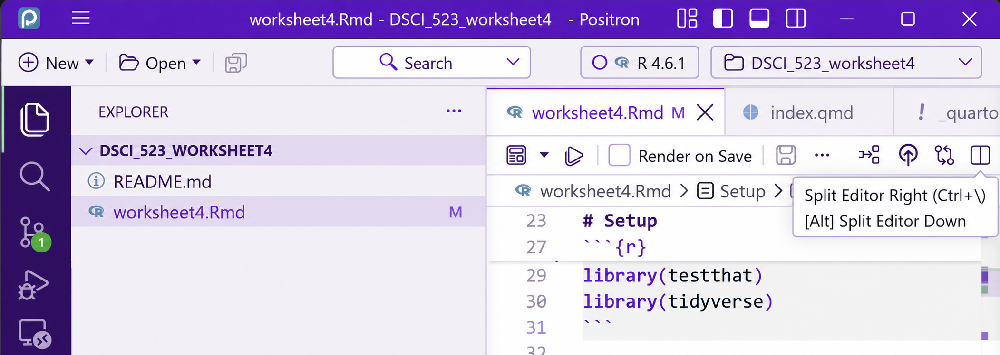

## what i've been up to

I just started a masters of data science program. going back to learn the fundamentals of computational linguistics has meant familiarizing myself with a subtly different set of tools. Data science platforms like R and Python are familiar to me, but digging into the details of Quarto (what this site is built with), standardizing my installs, getting used to uv (which is quite nice) and organizing everything has already taught me a lot that I missed on my own.

## making my workspace my own

I've been enthusiastic about finding ways to use AI to help with the setup around my work. I've been using Codex to keep track of my projects and deadlines, with an agents file asking it to help me understand what I've missed and diagnose errors while leaving the coursework to me. Lots of little things the agent helped with made the process nicer: importing a theme from my other project into Positron and figuring out why my pipe and comment hotkeys weren't working - after trying the same two settings over and over, it pointed out i just had to switch from visual mode to source view. Small things, but they make the workspace feel more like somewhere I want to spend time while letting me focus on what I want to say and do.

{fig-alt="Positron with a violet and lavender theme, showing an R Markdown file in Source view. Identifying repository suffixes have been covered." width=100%}

## how i got here

I've always enjoyed working with computers, and recently been getting more seriously interested in language, machine learning, and making things of my own. This has meant learning pytorch, trying some RL experiments, vibe-coding CV apps with mediapipe, a lot of random readings, and trying to piece everything together through projects. Coming back to study feels like a chance to understand more about what's underneath the hood.

::: {.small}
*I used OpenAI Codex to help draft and edit this post, and OpenAI's image tool to crop and redact the screenshot.*
:::
