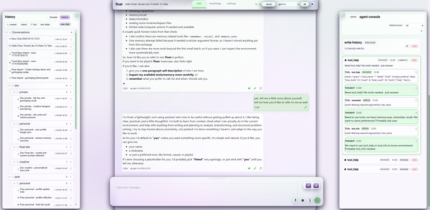
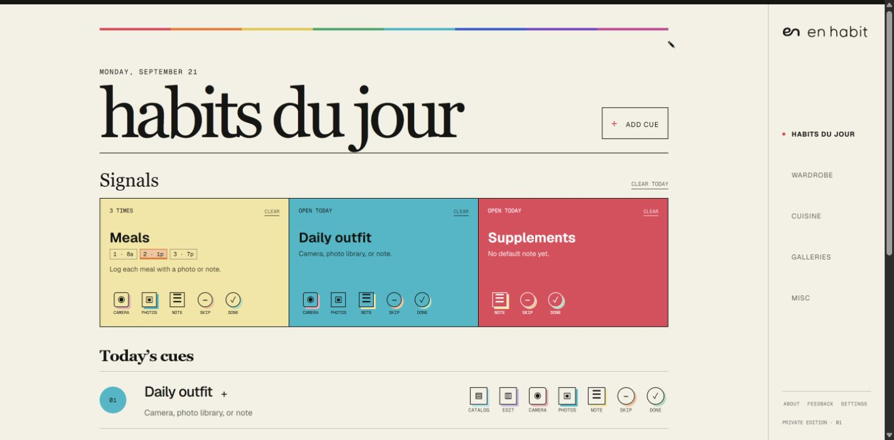
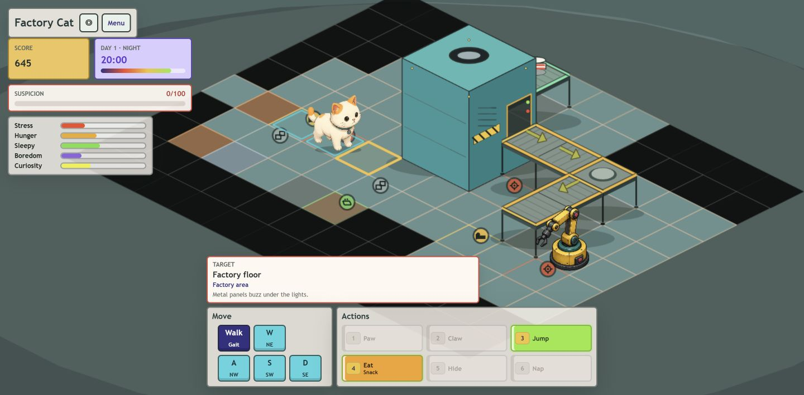
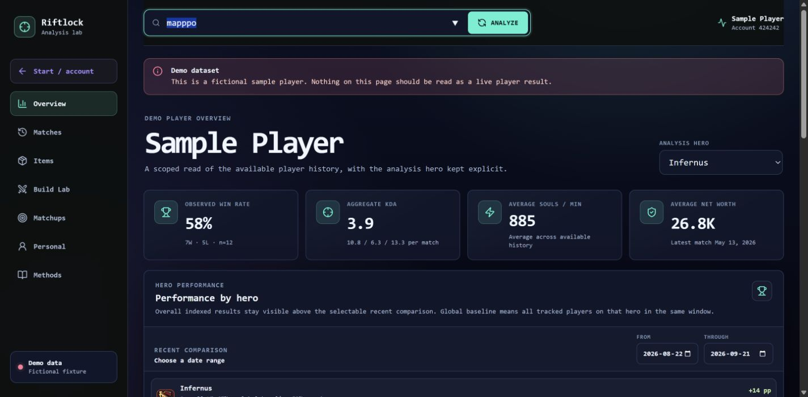
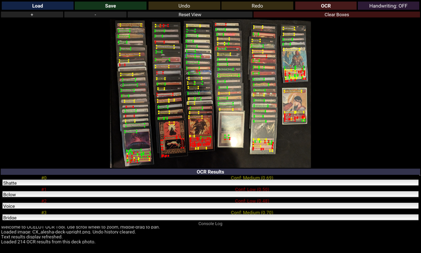

a few things i'm working on - more to add as i go.

::: {.project-entry}

::: {.project-details}

## float

a privacy-focused personal agent & workspace with memory and tools.

[github](https://github.com/CherryResearch/float) · [introducing float](https://cherryresearch.github.io/post.html?post=introducing-float)

:::
:::

::: {.project-entry}

::: {.project-details}

## en habit

a work in progress personal habit tracker, wardrobe catalog, and photo journal.

[open en habit](https://en-habit.ch3rry.chatgpt.site/) (reach out to request access)

:::
:::

::: {.project-entry}

::: {.project-details}

## factory cat

a browser game in progress about being a stray cat in a cat-food factory. explore, cause trouble, and find somewhere to nap.

[open factory cat](https://factory-cat-game.ch3rry.chatgpt.site/) (reach out to request access)

:::
:::

::: {.project-entry}

::: {.project-details}

## riftlock

an early Deadlock analysis lab for match history, hero performance, and item/build ideas. live history can be incomplete; there's a sample dashboard to explore too.

[open riftlock](https://riftlock-deadlock-lab.ch3rry.chatgpt.site/) (reach out to request access)

:::
:::

::: {.project-entry}

::: {.project-details}

## OCELOT

originally made for cataloguing Magic: The Gathering cards. OCR based text recognition and editing, organized around selectable text regions.

[github](https://github.com/firecat1234/OCELOT-)

:::
:::

<!-- Screenshots: Float uses its published docs/ui-snapshot-2026-04-12.png.
     En Habit uses a local synthetic preview with no personal records.
     Factory Cat and Riftlock were captured from Sites on 2026-09-21;
     Riftlock shows its fictional demo dataset.
     OCELOT shows the user's Alesha deck, losslessly cropped and rotated from
     PXL_20251115_192804227.MP.jpg, with real OCR output and a 4080 x 2460 UI capture.
     Click a preview for the full image. -->
